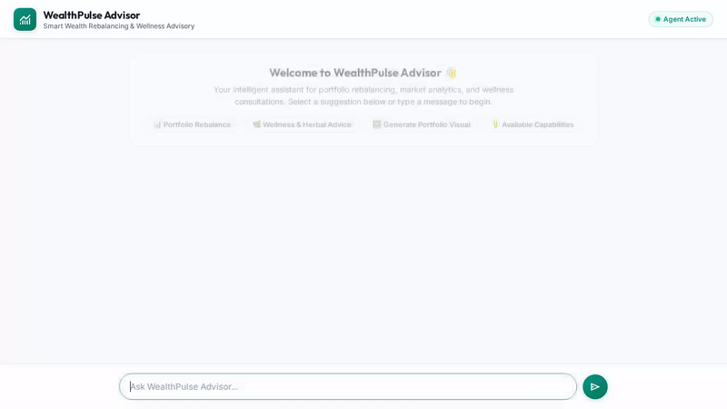

# WealthPulse Advisor 📈🌿

**WealthPulse Advisor** is an autonomous financial management and holistic wealth advisory agent built with the **Google Antigravity ADK (Agent Development Kit)** and deployed on **Google Cloud Agent Platform (Reasoning Engine)**.

It provides intelligent portfolio rebalancing, asset allocation tracking, financial visual chart generation, and grounded wellness consultations using Google Cloud's AI infrastructure.

---

## 📽️ Demo Recording



*The demo above illustrates real-time portfolio rebalancing analysis rendered via **A2UI**, followed by automatic tool invocation for financial chart generation and GCS image rendering.*

---

## 🚀 Key Features

* 📊 **Portfolio Holdings & Firestore Integration**: Real-time database tracking of equities, bonds, ETFs, and cash holdings stored in Cloud Firestore.
* ⚖️ **Target Asset Allocation & Rebalancing**: Calculates portfolio drift against custom target allocations (e.g. 80/20 Equities/Bonds) and outputs exact dollar-amount buy/sell recommendations.
* 🖼️ **Financial Visual Chart Generation**: Uses a code executor sandbox to create visual asset breakdown charts, automatically uploading them to Google Cloud Storage.
* 🌿 **Grounded RAG Knowledge Retrieval**: Integrates a serverless **Vertex AI RAG Engine** corpus for grounded consultations on herbal remedies, stress management, and holistic wealth wellness.
* 🧠 **Cross-Session Long-Term Memory**: Uses **Vertex AI Memory Bank** to automatically retain client preferences, risk profiles, and historical interactions across conversations.
* 🎨 **Interactive A2UI Rendering**: Generates rich UI cards, surface updates, and formatted displays rendered directly in the chat frontend using the **A2UI Protocol**.

---

## ☁️ Google Cloud & AI Tools Used

| Tool / Technology | Description & Usage |
| :--- | :--- |
| **Vertex AI Memory Bank** | Manages cross-session long-term memory via `PreloadMemoryTool` and post-turn memory extraction callbacks. |
| **Cloud Firestore** | NoSQL database storing user portfolio holdings (`portfolio_holdings` collection) for real-time reads and updates. |
| **Google Cloud Storage (GCS)** | Public asset bucket (`wealthpulse-assets-*`) for hosting generated chart images and media assets. |
| **Vertex AI RAG Engine** | Serverless RAG store providing grounded document retrieval on specialized wellness and financial knowledge. |
| **Code Sandbox / Image Generation** | Code execution sandbox for generating matplotlib financial breakdown graphics. |
| **A2UI Protocol** | Agent-side UI component rendering framework (`a2ui_callback`) emitting structured cards, columns, and image components. |
| **Cloud Run** | Host for the containerized FastAPI proxy and custom dialogue frontend (`wealthpulse-frontend`). |
| **Reasoning Engine (Agent Platform)** | Serverless deployment runtime for the ADK agent over the **A2A Protocol**. |

---

## 🛠️ Architecture Overview

```
                          [ User Browser ]
                                 │
                                 ▼
                     [ Cloud Run / FastAPI Proxy ]
                          (Port 8080 / ADC Auth)
                                 │  A2A Protocol
                                 ▼
         [ Reasoning Engine / Agent Runtime (Gemini 2.5) ]
         ├── Memory Bank (Long-Term Memory)
         ├── Firestore (Portfolio Holdings Database)
         ├── Cloud Storage (Generated Chart Assets)
         ├── Serverless RAG Engine (Grounded Retrieval)
         └── A2UI Callback (Rich Card Surfaces)
```

---

## 💻 Local Setup & Quick Start

### 1. Prerequisites
* **Python 3.11+** & **uv**
* **Google Cloud SDK** (`gcloud`) with active GCP credentials (`gcloud auth application-default login`)

### 2. Install Dependencies
```bash
uv pip install -r requirements.txt
```

### 3. Launch Local Custom Playground
To run the custom branded frontend proxy wired to the deployed agent:
```bash
python frontend/main.py
```
Open [http://localhost:8080](http://localhost:8080) in your browser.

---

## 🚢 Cloud Run Deployment

To deploy the frontend proxy to Cloud Run and connect it to your Reasoning Engine agent:

```bash
gcloud run deploy wealthpulse-frontend \
  --source ./frontend \
  --region us-central1 \
  --allow-unauthenticated \
  --set-env-vars AGENT_ENGINE_RESOURCE_NAME="projects/664309893743/locations/us-central1/reasoningEngines/2893472050876252160",AGENT_DIRECTORY="app" \
  --project qwiklabs-gcp-03-4c89eb0d0a8d
```

### Required IAM Roles
Ensure the Cloud Run default compute service account (`<project-number>-compute@developer.gserviceaccount.com`) has the following role:
* `roles/aiplatform.user`

Ensure the Reasoning Engine service account (`service-<project-number>@gcp-sa-aiplatform-re.iam.gserviceaccount.com`) has:
* `roles/datastore.user` (Firestore)
* `roles/storage.objectAdmin` (GCS Bucket)
